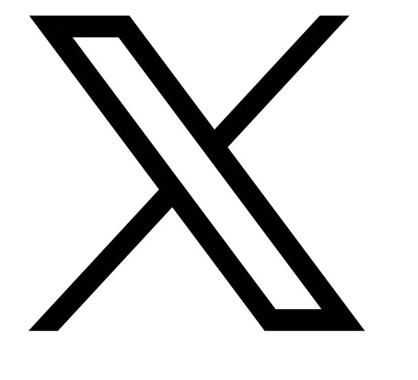
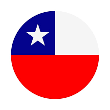
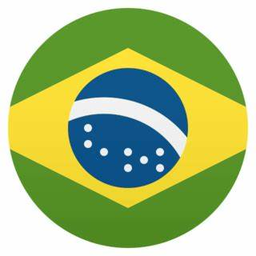

Estamos muy felices de presentar a los conferencistas que nos acompañarán en el R Day.

  
[Gonzalo Contador Revetria](https://matematica.usm.cl/contador-gonzalo/)  
Profesor Universidad Técnica Federico Santa María.  
  

 
 

  
[Andressa Nunes Siroky](https://sigaa.ufrn.br/sigaa/public/docente/portal.jsf?siape=1062376)  
Profesora Universidade Federal Rio Grande do Norte.  
  

 
