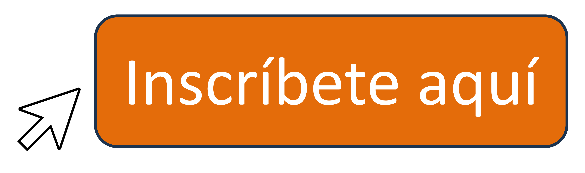

 
 

 
 

¡Ya te puedes inscribir! la fecha límite de inscripción es 15 de octubre de 2025.

 

Dá clic en el siguiente botón.

 
 

R Day es un evento que ha tenido un impacto positivo en la comunidad científica y empresarial debido a la versatilidad del lenguaje de programación R para estadística y ciencia de datos. 

El R Day se ha realizado dos veces en Medellín ([2019](https://rday-colombia.github.io/2019/) y [2023](https://rday-colombia.github.io/2023/)) y en este año se realizará por tercera vez en Medellín de forma **presencial** el 14 de noviembre del 2025. Con el R Day queremos integrar la comunidad de usuarios de R en la ciudad de Medellín y llamar la atención de quienes aún no lo conocen.

 
 

<h1> Organizan </h1>

     
 
 
 
     
<h1> Apoyan </h1>

     
 
     

     
 

     

 
 
 

Mapa de visitas al sitio.

