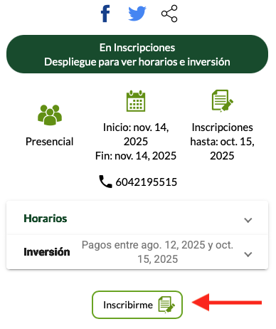

En este momento estamos realizando **la preinscripción** (aún no la inscripción formal) para el **R Day**, a través de una de las universidades coorganizadoras: la **Universidad de Antioquia**.

### Pasos para realizar la preinscripción

1. Tenga a la mano un pdf de su documento de identidad (por ejemplo, cédula).
2. Visite [este enlace](https://share.udea.edu.co/?q=po:c48621).
3. Haga clic en el botón **Inscribirme** y siga las instrucciones.  
  
En la figura de abajo se muestra la ubicación del botón de inscripción:

Una vez alcancemos un total de **100 preinscritos**, recibirá un correo electrónico notificándole que la inscripción formal ya está disponible.

El valor de la inscripción al **R Day** es de $130.000.

Si tiene cualquier inquietud, no dude en escribirnos a: [rdaycolombia@gmail.com](mailto:rdaycolombia@gmail.com).

 
 

