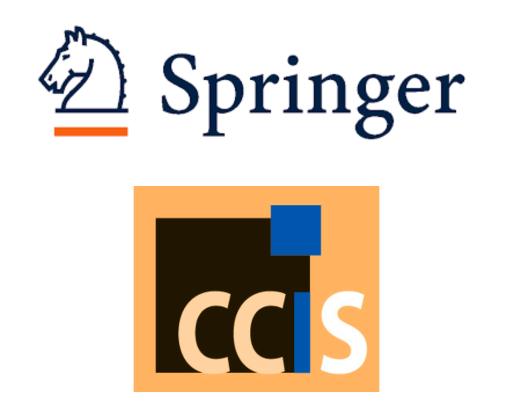

The 3rd RDay Colombia 2025 is being set up in the CCIS series as:

- Post-proceedings event
- Non Open-access
- Biviana Suárez, Olga Usuga Manco, Carmen Patiño, Romario Conto, Freddy Hernández as volume editors
- Camera-ready delivery set to 31/12/2025
    
The authors of accepted papers to use Springer templates when preparing the camera-ready version. They are available in Latex and MSword at:  [https://www.springer.com/gp/computer-science/lncs/conference-proceedings-guidelines](https://www.springer.com/gp/computer-science/lncs/conference-proceedings-guidelines)

To learn about Springer's code of conduct and see a more detailed guide on how to use the templates, we recommend reading the following two files:

- [Code of conduct](https://github.com/rday-colombia/2025/blob/main/documentos/proceedings/Publisher's_Code_of_Conduct_for_Book_Authors.pdf).
- [Instructions for authors](https://github.com/rday-colombia/2025/blob/main/documentos/proceedings/Springer_Instructions_for_Authors_of_Proceedings_CS.pdf).
- [Licence to Publish – Proceedings Papers](https://github.com/rday-colombia/2025/blob/main/documentos/proceedings/SNCS_ProceedingsPaper_LTP_ST_SN_Switzerland.docx).

