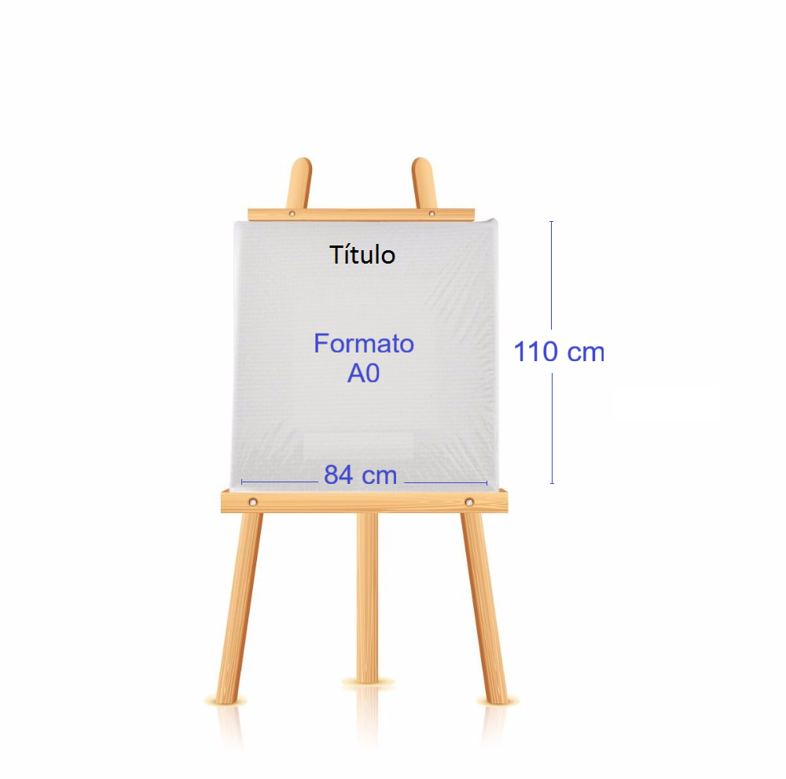

Abajo se encuentran las respuestas a preguntas más frecuentes (frequently asked questions).

## ¿Dónde puedo encontrar los certificados?

Los certificados estarán disponibles en esta misma página de FAQ el día domingo 30 de noviembre de 2025. 

- [Certificados de asistentes](https://github.com/rday-colombia/2025/tree/main/documentos/Certificados/Certificados%20Asistentes%20R%20Day%202025).
- [Certificados de ponentes](https://github.com/rday-colombia/2025/tree/main/documentos/Certificados/Certificados%20Ponentes%20R%20Day%202025).

 

## ¿Dónde puedo encontrar las fotos del evento 📷 ?

Para ver las fotos del evento visite [este enlace](https://www.flickr.com/groups/rday2025/). El grupo de flickr es libre así que usted también puede subir sus fotos del evento.

 

## ¿Dónde puedo encontrar los videos de las conferencias 🎤?

Para ver las conferencias visite [este enlace](https://rday-colombia.github.io/2025/conferencistas01.html). Debajo de la foto de cada conferencista está el video YouTube con la grabación.

 

## ¿Dónde puedo encontrar los tutoriales 💻?

Para consultar el material de los tutoriales visite [este enlace](https://github.com/rday-colombia/tutoriales_Rday_2025).

 

## ¿Dónde puedo encontrar los Proceedings del evento 📓?

Cuando estén listo los proceedings las podrá encontrar [este enlace]().

 

## ¿Existen medidas y formato sugeridos para el póster?

Se recomienda que el póster se imprima en tamaño A0 (84 cm x 110 cm).

El formato para el póster es libre.
